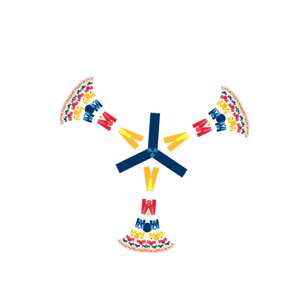

Apaixonado por tecnologia, café e um bom livro.

<h1>Sobre Mim</h1>

- Tenho 23 anos e estou no segundo ano do curso de Engenharia da Computação.

- Apaixonado por violão, 

- Sou um desenvolvedor front-end, aprimorando meus conhecimentos e buscando adiquirir novos para me tornar full-stack.

- Tenho experiência em HTML, CSS e JavaScript, que são as bases do meu trabalho criativo e interativo, e estou em contante evolução com React.

- Possuo conhecimento em PhotoShop e Figma

<h1>Tecnologias</h1>

